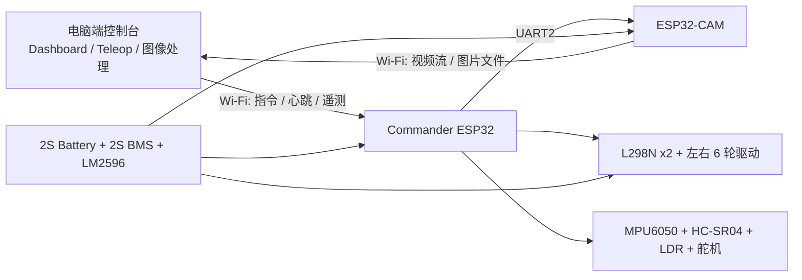
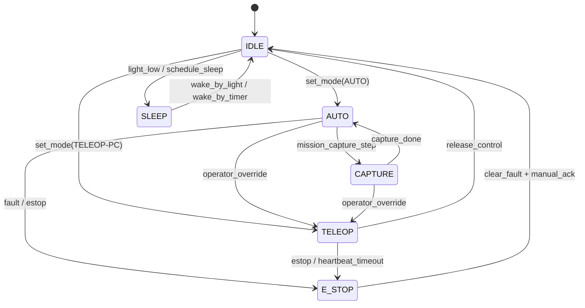

# Ares 自动驾驶与电脑接管控制架构草案

## 1. 文档目标

本文档用于明确 `PROJECT ARES / Operation MROS` 在当前原型阶段的控制架构，目标是同时满足以下两类能力：

- 火星车可以在本地传感器支持下执行基础自动驾驶。
- 操作者仍然可以在电脑端实时查看状态，并在需要时手动接管控制。

本文档默认延续仓库现有的 `双脑架构`，不直接照搬 `OpenRover` 的整套电控平台，只吸收其轮组、驱动系统布局和机械臂扩展思路。

## 2. 依据文档

本草案主要依据以下仓库资料：

- `output/doc/⭐火星车原型制作完整指南.md`
- `output/doc/⭐火星车主采购清单(中文版) STAR.md`
- `output/doc/⭐Ares Master Wiring Chart.md`
- `⭐Ares Dual-Brain GPIO Map.docx`

## 3. 现有基线与文档明确内容

以下内容属于现有文档中已经明确给出的基线：

- 整车采用 `ESP32 NodeMCU + ESP32-CAM` 双脑架构。
- 主控 `ESP32` 负责电机控制、超声波、`MPU6050`、休眠唤醒、舵机动作和对相机板发指令。
- `ESP32-CAM` 负责拍照、图像回传，以及必要的串口确认。
- 底盘默认是六轮方案，左右各 3 个 TT 电机并联，由两块 `L298N` 分别驱动。
- 主控与相机板之间通过串口交叉连接：
  - `Commander GPIO 16 (RX2) <- ESP32-CAM TX`
  - `Commander GPIO 17 (TX2) -> ESP32-CAM RX`
- 当前 `Wiring Chart` 中的关键主控引脚分配如下：
  - 左驱动：`GPIO 32`、`GPIO 33`
  - 右驱动：`GPIO 25`、`GPIO 26`
  - `MPU6050`：`GPIO 21/22`
  - 超声波：`GPIO 19/18`
  - 扫描舵机：`GPIO 4`
  - 左右太阳能翼舵机：`GPIO 13/12`

## 4. 已知文档冲突与本草案处理方式

### 4.1 充电方案冲突

- `完整指南` 提到 `TP4056`。
- `采购清单` 与 `Wiring Chart` 明确围绕 `2S BMS + 2x18650 串联 + 7.4V` 工作。

本草案默认采用 `2S BMS` 方案，因为它与双节串联电池和整车电压等级更一致，也更符合当前仓库的安全基线。

### 4.2 超声波方案冲突

- `完整指南` 倾向于 `前 / 左前 / 右前` 三个独立 HC-SR04。
- `Wiring Chart` 把 3 个 HC-SR04 并到同一组 `Trig/Echo`，等效为一个“总前保险杠”。

本草案给出两级实现路线：

- `AUTO-L1`：兼容当前 `Wiring Chart`，按“并联单前向感知”实现基础自动避障。
- `AUTO-L2`：推荐升级为“独立三向感知”，这样自动驾驶才具备更可靠的选路能力。

也就是说，本文不会静默混用两种方案，而是把它们明确区分为“当前兼容实现”和“推荐升级实现”。

## 5. 与 OpenRover 的参考边界

`OpenRover robotic platform` 适合作为以下方面的参考：

- 轮组、车轮安装方式和更稳健的电机机械布局。
- 机械臂的结构思路、挂载位置和电脑端联动操作体验。
- 人机界面层面的“监控 + 手动接管”设计思路。

但 `Ares` 当前阶段不建议直接照搬 `OpenRover` 的整套多板控制结构。原因如下：

- 当前仓库已经明确了 `ESP32 主控 + ESP32-CAM` 的双脑基线。
- 项目有明显的低成本约束，不适合直接引入更多上位板卡。
- 当前任务重点是先把“能自动跑，也能从电脑接管”做通，而不是先把整车做成复杂多处理器平台。

因此，本草案采用“借机械，不借全套电控”的策略。

## 6. 推荐系统架构



### 6.1 推荐网络拓扑

为了同时满足电脑控制和相机图传，推荐以下网络方式：

- 电脑开启热点，作为整车调试阶段的临时局域网中心。
- `Commander ESP32` 接入该热点，提供控制接口和遥测接口。
- `ESP32-CAM` 也接入同一热点，直接向电脑提供视频流或图片上传。

这样做的好处是：

- 电脑可以直接控制主控板。
- 电脑可以直接接收相机流，不必让主控转发图像。
- 主控与相机板仍保留 `UART` 控制链路，用于可靠的任务级命令和确认。

## 7. 子系统职责划分

### 7.1 Commander ESP32

`Commander` 是底盘运动的唯一仲裁者，负责：

- 左右电机启停、方向与速度控制。
- `MPU6050` 姿态修正与直线保持。
- 超声波避障逻辑。
- `AUTO / TELEOP-PC / E-STOP / IDLE` 模式切换。
- 舵机控制，包括扫描舵机和未来可能扩展的机械臂互锁。
- 向 `ESP32-CAM` 下发拍照、扫描、状态查询命令。
- 向电脑端回传整车遥测。

### 7.2 ESP32-CAM

`ESP32-CAM` 是视觉从板，负责：

- 拍照。
- 360 度扫描过程中的图像采集。
- 伪 3D 拍摄任务中的图像采集确认。
- 通过 Wi-Fi 向电脑端提供实时画面或文件上传。
- 通过 UART 向主控回传 `ACK / BUSY / DONE / ERROR`。

### 7.3 电脑端

电脑端不是底盘运动执行器，而是“操作与后处理中心”，负责：

- 实时显示遥测、模式、报警和连接状态。
- 手动驾驶输入。
- 下发模式切换命令。
- 查看视频流和拍摄结果。
- 做全景拼接、伪 3D 合成、地图后处理。
- 在需要时强制人工接管，或发送 `E-STOP`。

## 8. 控制模式与优先级

### 8.1 模式定义

| 模式 | 作用 | 谁发起 | 底盘动作权限 |
| --- | --- | --- | --- |
| `IDLE` | 上电待命 / 任务前静止状态 | 系统默认 | 禁止移动，仅保留监测 |
| `AUTO` | 基础自动驾驶 | 电脑或本地任务逻辑 | 主控本地闭环控制 |
| `TELEOP-PC` | 电脑端人工驾驶接管 | 电脑端 | 电脑发指令，主控执行 |
| `CAPTURE` | 原地或低速执行拍摄动作 | 主控任务逻辑 | 受任务脚本限制 |
| `E-STOP` | 紧急停车 | 电脑端或本地故障逻辑 | 全部驱动立即停机 |
| `SLEEP` | 低功耗休眠 | 主控任务逻辑 | 电机关闭 |

### 8.2 优先级

模式优先级按以下顺序处理：

1. `E-STOP`
2. 硬件故障 / 欠压保护
3. `TELEOP-PC`
4. `AUTO`
5. `CAPTURE`
6. `IDLE`
7. `SLEEP`

说明：

- 只要收到有效 `E-STOP`，必须立即切断运动输出。
- 只要操作者在 `AUTO` 模式下发出有效人工驾驶指令，系统应切入 `TELEOP-PC`。
- 如果电脑端在 `TELEOP-PC` 模式下心跳丢失，整车不应继续盲目前进，而应转入 `IDLE` 或 `E-STOP`。

### 8.3 推荐状态机



## 9. 自动驾驶能力建议

### 9.1 AUTO-L1：兼容当前接线图的基础自动驾驶

如果保留当前 `Wiring Chart` 的“3 个 HC-SR04 并联到同一组 `Trig/Echo`”，则自动驾驶能力建议定义为：

- `MPU6050` 做直线保持。
- 前方检测到障碍时立刻停车。
- 采用预设回避动作，例如：
  - 后退固定时长；
  - 原地左转固定角度；
  - 再次试探前进。

这种模式可以实现“基础自动跑”，但其本质更接近“前向碰撞规避”，而不是高质量选路自动驾驶。

### 9.2 AUTO-L2：推荐的三向感知自动驾驶

如果为了更像真正的自动驾驶，建议将超声波升级为独立三向感知：

- `Front` 用于正前避障。
- `Front-Left` 与 `Front-Right` 用于比较左右通行空间。
- 当前方距离低于阈值时，主控读取左右距离，选择更大侧转向。

这一路线更符合 `完整指南` 中“前 / 左前 / 右前”三探头寻路逻辑，也更适合你后续做地图和任务路径记录。

### 9.3 直线保持

无论使用 `AUTO-L1` 还是 `AUTO-L2`，都建议保持以下闭环：

- `目标航向` 在每次直行段开始时锁定。
- `MPU6050` 实时给出偏航变化。
- 主控根据偏差对左右轮组做小幅差速修正。

这里有一个工程提醒：

- 当前接线图只给出了 `L298N` 的方向控制口，没有单独展开 `ENA/ENB` 速度使能口。
- 如果继续沿用当前接线，速度调节可以通过对方向输入脚输出 `PWM` 来实现。
- 如果后续发现调速效果不足，再考虑把 `ENA/ENB` 也纳入正式引脚表。

## 10. 电脑端人工接管设计

### 10.1 设计原则

- 电脑端负责“下达意图”，主控负责“安全执行”。
- 电脑端不直接绕过主控去控制电机驱动器。
- 所有人工控制都必须经过主控的安全仲裁。

### 10.2 推荐交互

电脑端建议提供以下界面元素：

- 视频窗口。
- 模式切换按钮：`AUTO`、`TELEOP-PC`、`IDLE`、`E-STOP`。
- 虚拟摇杆或键盘控制。
- 实时遥测显示：电压、当前模式、障碍距离、姿态角、相机状态。
- 任务按钮：`开始全景拍摄`、`开始伪 3D 拍摄`、`停止任务`。

### 10.3 人工接管规则

- 在 `AUTO` 模式下，只要电脑端持续发送非零速度指令并保持心跳，系统切换为 `TELEOP-PC`。
- 在 `TELEOP-PC` 模式下，若心跳超过超时阈值未更新，主控立即停车。
- 人工接管结束后，不自动恢复 `AUTO`，应由操作者显式点击恢复，避免误恢复。

## 11. 通信接口建议

### 11.1 电脑 <-> Commander

推荐使用 `Wi-Fi + WebSocket`，原因是：

- 能双向实时通信。
- 适合遥测高频回传。
- 适合浏览器或桌面上位机同时使用。

推荐消息格式使用轻量 JSON。

#### 电脑端下行命令示例

```json
{"type":"heartbeat","ts":1712390400}
{"type":"set_mode","mode":"AUTO"}
{"type":"set_mode","mode":"TELEOP-PC"}
{"type":"drive","throttle":0.45,"turn":-0.20}
{"type":"task","name":"capture_panorama","step_deg":30}
{"type":"estop","active":true}
```

#### 主控上行遥测示例

```json
{"type":"telemetry","mode":"AUTO","battery_v":7.6,"yaw":2.3,"front_cm":34,"cam":"READY"}
{"type":"alert","level":"WARN","code":"HEARTBEAT_LOST"}
{"type":"task_state","name":"capture_panorama","state":"RUNNING","index":3}
```

### 11.2 Commander <-> ESP32-CAM

推荐继续沿用当前文档已经明确的 `UART2` 通道：

- `Commander GPIO 17 (TX2) -> ESP32-CAM RX`
- `Commander GPIO 16 (RX2) <- ESP32-CAM TX`

推荐使用简单的 ASCII 行协议，便于串口调试。

#### 主控下发示例

```text
PING
CAPTURE STILL pano_003
CAPTURE STILL stereo_left
CAPTURE STILL stereo_right
STREAM START
STREAM STOP
STATUS?
```

#### 相机板回传示例

```text
ACK PING
ACK CAPTURE pano_003
DONE CAPTURE pano_003
BUSY
ERR SD_WRITE_FAIL
STATUS READY
```

### 11.3 心跳机制

建议至少保留两类心跳：

- `PC -> Commander`：用于判断人工接管链路是否在线。
- `Commander -> ESP32-CAM`：用于判断相机从板是否存活。

## 12. 机械臂扩展建议

你提到可以参考 `OpenRover` 的机械臂，这个方向可以保留，但建议按“扩展载荷”处理，而不是并入当前最小可行原型基线。

### 12.1 建议边界

- 第一阶段先实现底盘自动驾驶与电脑接管。
- 机械臂作为第二阶段扩展。
- 机械臂动作默认只允许在 `TELEOP-PC` 或未来单独的 `MANIP` 模式下执行。

### 12.2 电气建议

- 机械臂不要直接挂在当前给逻辑板供电的 `5V BUS` 上。
- 若后续加入多自由度机械臂，建议新增独立 `Buck` 或独立舵机电源轨。
- 主控与机械臂之间必须做动作互锁，避免“高速行驶 + 大幅摆臂”导致翻车。

### 12.3 对现有目标的影响

引入机械臂会直接影响：

- 预算。
- 重心。
- 爬坡能力。
- 跌落抗性。
- 电池续航。

因此，机械臂应视为明确的架构增项，不应默认并入当前 `Ares` 基线 BOM。

## 13. 分阶段落地建议

### 阶段 1：先打通远程接管

- 电脑端能看到遥测。
- 电脑端能进入 `TELEOP-PC` 并控制底盘。
- `E-STOP` 可靠生效。

### 阶段 2：实现基础自动驾驶

- 主控完成 `MPU6050` 直线保持。
- 实现 `AUTO-L1` 的前向避障。
- 完成 `AUTO -> TELEOP-PC` 的人工接管切换。

### 阶段 3：接入拍摄任务

- 主控通过 UART 控制 `ESP32-CAM`。
- 完成全景拍摄任务状态流转。
- 完成伪 3D 两次拍摄触发与确认。

### 阶段 4：升级感知与扩展载荷

- 如果要提升自动驾驶质量，升级到独立三向 HC-SR04。
- 如果要引入 `OpenRover` 风格机械臂，再单独扩展控制模式和供电。

## 14. 待确认项

以下事项仍需要后续拍板：

- 自动驾驶是否正式采用 `AUTO-L2` 的三向独立超声波方案。
- `L298N` 调速是否满足直线修正要求，还是要把 `ENA/ENB` 正式纳入引脚表。
- 电脑端是优先做网页控制台，还是做桌面上位机。
- `ESP32-CAM` 图像上传是优先 MJPEG 视频流，还是优先拍照文件上传。
- 机械臂是否进入本期范围，还是留到第二阶段。

## 15. 结论

在当前仓库基线下，最稳妥的方案不是把 `Ares` 改成另一套完整平台，而是：

- 保持 `ESP32 主控 + ESP32-CAM` 双脑架构；
- 让主控成为运动与安全的唯一仲裁者；
- 让电脑端具备实时监控和人工接管能力；
- 让相机板专注视觉采集与图像回传；
- 把 `OpenRover` 的轮组、电机布局和机械臂思路作为“机械参考”和“第二阶段扩展”。

这条路线既保留了现有文档的一致性，也能直接支撑你提出的核心要求：`火星车可以自动驾驶，但我仍然能用电脑控制它。`

## 16. 机械减震与温度保护补充

### 16.1 Rocker-Bogie 机械减震

当前 `Ares` 原型不采用弹簧减震器，而采用被动连杆式 `Rocker-Bogie / 摇臂-转向架`：

- 每侧 3 个轮子由一根长摇臂和一根小转向架连接。
- 长摇臂通过主铰链连接中央车身，小转向架通过二级铰链连接长摇臂后端。
- 两个铰链都必须能自由转动，不能用热熔胶粘死。
- 主控舱、电池、驱动板尽量集中在中央车身，减少悬挂端重量。
- 电机线预留弯折余量，避免摇臂上下摆动时拉断线。

推荐第一版先固定六个轮子的朝向，用左右差速 / 坦克转向；不要一开始做全轮独立转向。

### 16.2 热控状态

增加以下温度保护状态，用于配合保温盒和可选温度传感器：

| 状态 | 触发条件 | 行为 |
| --- | --- | --- |
| `NORMAL` | 0°C ~ 45°C | 正常运行 |
| `COLD_START` | -10°C ~ 0°C | 低速短时运行，减少拍摄和电机负载 |
| `COLD_SLEEP` | < -10°C | 停止电机，进入低功耗等待 |
| `HOT_LIMIT` | 45°C ~ 50°C | 降低速度和拍摄频率 |
| `THERMAL_PAUSE` | > 50°C | 停车、停止拍摄、等待降温 |

主控遥测建议增加字段：

```json
{"type":"telemetry","mode":"AUTO","battery_v":7.6,"inside_temp_c":24.5,"thermal":"NORMAL"}
```

### 16.3 安全边界

- 基线方案只采用被动保温和温度监测，不默认加入主动加热片。
- 不允许裸电阻丝、无温控加热片直接贴近 18650 电池。
- 若未来加入主动加热，需要新增独立供电、保险丝、温控闭环和失效保护，不应直接挂在当前 `5V BUS` 或 `7.4V BUS` 上。

